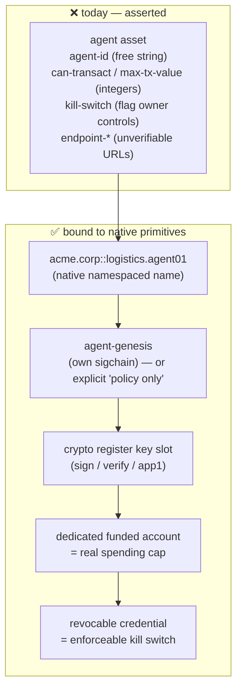
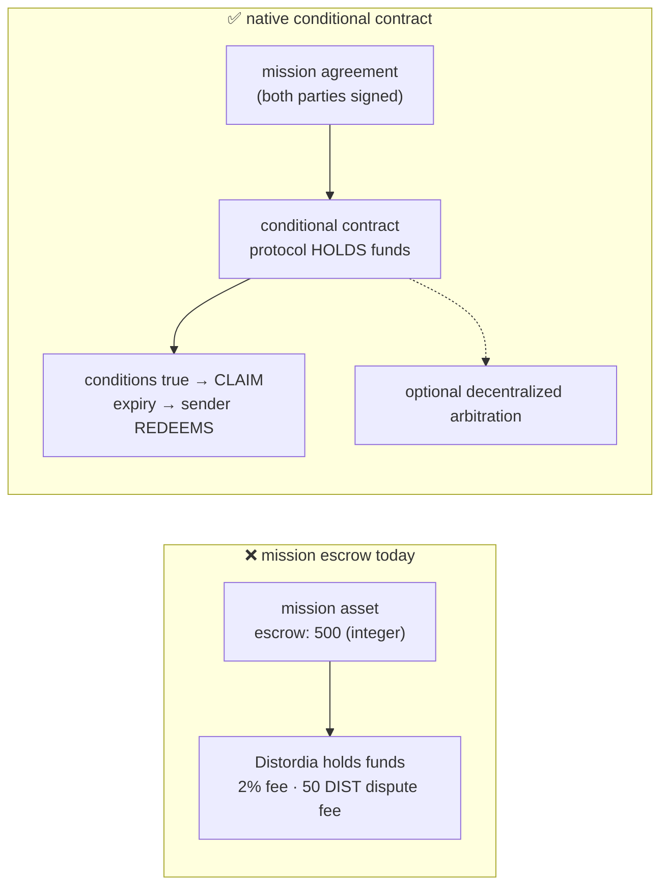

# Design Note — Aligning the Agent & Swarm Standards with Native Nexus Primitives

> **Status:** Design proposal (draft). Companion to the
> [namespace alignment note](namespace-nexus-alignment-note.md); extends
> [market evaluation](standards-market-evaluation.md) §8–§9 with Nexus-platform findings.
>
> **TL;DR:** Both standards describe capabilities they cannot enforce, because they store *numbers
> and flags in a record* where Nexus offers *real primitives*. The headline finding: the swarm
> mission contract implements **custodial, Distordia-mediated escrow** (a mutable `escrow` integer,
> a 2% fee, a 50 DIST dispute fee) when Nexus provides **native non-custodial conditional-contract
> escrow with automatic expiry/redemption** — and this repo's own NexGo Ride standard *already uses
> that primitive correctly*. The agent standard's `max-tx-value`, `kill-switch`, and endpoint claims
> are similarly unenforceable today, though Nexus's **crypto object register** and **account
> funding** can make two of the three real.

---

## 1. Native Nexus primitives in scope (verified)

| Primitive | What Nexus provides |
|---|---|
| **Conditional contracts** | Agreements whose conditions can be arbitrarily complex; if they evaluate true the recipient may CLAIM the funds/object (from a DEBIT or TRANSFER). |
| **Automatic escrow** | Funds are **held by the protocol** until conditions are met — non-custodial. More advanced non-custodial escrow **and arbitration** are explicitly possible. |
| **Expiration / redemption** | If the recipient cannot satisfy the conditions, after a sender-set period the transaction becomes **redeemable** by the sender. Native deadline + refund. |
| **Names & namespaces** | Globally unique namespace registers (1000 NXS); names inside them addressed `namespace::name`. See the [namespace note](namespace-nexus-alignment-note.md). |
| **Crypto object register** | Every sigchain gets a crypto register with **nine named public-key slots**: `auth`, `lisp`, `network`, `sign`, `verify`, `cert`, `app1`, `app2`, `app3`. |
| **Sigchain bootstrap** | Creating a sigchain creates 5 object registers: a default NXS account, a trust account, two name registers, and the crypto register. |
| **Tokens & accounts** | Native token/account registers with debit/credit — real balances, not asserted integers. |

**Not yet native (roadmap):** *programmable access patterns to a sigchain with multiple sets of
credentials* (a "Sigchain Ledger VM"). This matters below: **delegated, limited signing authority
for an agent is not chain-enforceable today.**

---

## 2. Agent standard — findings

**A1 — `agent-id` + `namespace` reinvents `namespace::name`.**
An agent is naturally a **name inside its parent namespace** — `acme.corp::logistics.agent01` —
which gives native uniqueness, human-readable global resolution, and transferability for free.
Today `agent-id` is a free string (with a hyphen-permitting pattern) and `namespace` is a separate
unenforced field, so two sigchains can claim the same `agent-id` under the same `namespace`.

**A2 — No sigchain/genesis binding — the central unanswered question.**
The standard never states whether an agent **has its own sigchain**. Everything operational hinges
on this:
- If the agent has its own sigchain, the asset should record its **`agent-genesis`**, and the
  parent relationship is an attestation — the agent can then genuinely sign and transact.
- If the agent is a delegate of the org's sigchain, then **Nexus cannot today enforce limited
  authority** (that's the roadmap item above). `can-transact` / `can-sign` / `max-tx-value` are then
  *application policy*, not chain-enforced guarantees, and the standard must say so plainly.

Either way this must be explicit; right now readers will assume enforcement that does not exist.

**A3 — Endpoints are unverifiable; Nexus already ships the fix.**
`endpoint-a2a`, `endpoint-mcp`, `endpoint-health` are bare URL strings. A counterparty cannot prove
an endpoint belongs to this agent — the exact "endpoint identity proof" gap flagged in the market
evaluation. Nexus's **crypto object register** provides `sign`/`verify`/`app1..3` key slots: publish
the agent's public key (or the slot it uses) in the asset, sign endpoint responses and A2A messages
with it, and verification becomes real. This is the single highest-value native fix for the agent
standard.

**A4 — `kill-switch` as written is unenforceable.**
`kill-switch: 1` plus `kill-auth` ("namespaces authorized to trigger") lives in an asset **owned by
the agent's own owner**. On Nexus only the owner can update their asset, so the listed killers
cannot actually flip it — precisely when you'd need them to. Native routes that work:
1. **Own the agent asset from the parent org's sigchain** so the parent really can set
   `status: suspended`; or
2. make the agent's operating authority derive from a **token/credential it must hold**, which the
   issuer can revoke (revocation is enforceable, a flag is not); or
3. gate the agent's spending account with **conditional contracts**.

**A5 — `max-tx-value` can be made real by funding, not by asserting.**
Rather than an unenforceable integer, point the agent at a **dedicated NXS/DIST account register**
and fund it to the intended ceiling. A funded account *is* a chain-enforced spending cap, and
top-ups become an explicit, auditable act.

**A6 — `created-ts` duplicates the native `created` system attribute.** Keep only if it records a
genuinely different business event; otherwise drop it (see the product note's rule on not
redefining platform-assigned fields).

---

## 3. Swarm standard — findings

**S1 — Escrow is custodial and operator-mediated; Nexus escrow is not. (Headline.)**
The mission contract models escrow as a **mutable `escrow` integer** with `payment-type: "escrow"`,
a **2% fee retained by Distordia**, and a **50 DIST dispute filing fee** paid to Distordia. That is
a trusted operator holding funds and arbitrating. Nexus instead offers **conditional contracts where
the protocol holds the funds**, releases them when conditions evaluate true, and — critically —
**makes them redeemable by the sender after a set period** if conditions aren't met.

This is also a **repo-internal inconsistency**: [`nexgo-ride`](../standards/nexgo-ride-standard.json)
already uses the native path (atomic DEBIT + CLAIM through the Invoices API, explicitly noting
"no escrow needed"). Two standards in the same repo solve the same problem in opposite ways, and
the swarm one picked the centralized option.

**S2 — `deadline-ts` and `penalty-late` should map to native expiration.** Native contract expiry
already gives deadline-plus-refund semantics; today these are numbers no one enforces.

**S3 — `payment`, `stake`, `escrow`, `final-payment` are integers, not custody.** None reference a
token or account register. Without an account address there is no way to verify the stake exists.

**S4 — `members` is a 256-char pipe-separated string.** This caps swarm size, provides no membership
proof, and duplicates `member-count`. Two native alternatives, both verifiable:
- members are **names inside the swarm's namespace** (`acme.fleet::agent01`), or
- membership is **holding a swarm token** — issue a token register and distribute units; membership
  becomes countable and provable on-chain, and revoking a member is a token operation.

**S5 — `swarm-id` + `namespace` reinvents `namespace::name`** (same as A1).

**S6 — `missions-done` / `missions-failed` / `reputation` are self-written mutable counters.**
Mission contracts are themselves on-chain assets, so these should be **derived by query**, not
asserted by the swarm owner. Storing them invites inflation and contradicts the ecosystem-wide
"reputation needs provenance" finding (market evaluation §13, P0).

**S7 — The mission contract is one asset owned by one party.** Contractor and contractee cannot both
sign it — the same trust asymmetry already fixed in NexGo Ride v0.2.0 via
request → **counterparty-signed offer** → agreement. Missions need the same shape, or the mutual
commitment should live in the conditional contract itself.

**S8 — Dispute resolution centralizes on Distordia**, contradicting the p2p goal, when Nexus
explicitly supports non-custodial escrow **and arbitration**.

---

## 4. Proposed changes (v0.2.0 sketch)

**Agent**
| Change | Native primitive used |
|---|---|
| Name agents `parent.namespace::agent.id`; constrain the id | Names & namespaces |
| Add `agent-genesis` (own sigchain) **or** state "policy-only, not chain-enforced" | Sigchain |
| Add `pubkey` / `key-slot` for endpoint + message signature verification | Crypto object register |
| Add `spend-account` (funded account address) alongside `max-tx-value` | Token/account registers |
| Make the kill path a **revocable credential** or parent-owned status field | Ownership / tokens |
| Drop `created-ts` unless semantically distinct from `created` | System attributes |

**Swarm**
| Change | Native primitive used |
|---|---|
| Replace the `escrow` integer + Distordia custody with a **conditional contract reference** | Conditional contracts |
| Map `deadline-ts` / `penalty-late` to contract **expiration/redemption** | Native expiry |
| Add `stake-account` / `payment-account` register addresses | Token/account registers |
| Replace `members` string with **namespaced names or a membership token** | Names / tokens |
| Derive `missions-*` and `reputation` by query; stop storing them | On-chain mission assets |
| Split the mission into request → counterparty-signed offer → agreement | Mirrors NexGo Ride v0.2.0 |
| Route disputes to decentralized arbitration | Non-custodial arbitration |

## 5. What stays as-is

The **safety-oriented intent** of the agent standard (kill switch, rate limits, transaction caps,
capability declaration) is ahead of the market and worth keeping — the issue is enforcement, not
concept. Likewise the swarm **mission-contract concept** (deliverable, milestones, penalties,
track record) is genuinely novel; only its custody and trust model need replacing.

## 6. Open questions

- **Does a Distordia agent hold its own sigchain?** This is a product decision, not a schema one,
  and it determines whether A2/A5 are solvable today or must wait for the Sigchain Ledger VM.
- **Exact conditional-contract syntax** (condition grammar, how expiry is expressed in the API) was
  not verifiable in detail from public docs during this review — confirm before writing v0.2.0
  schemas that reference it.
- **Rate limits** (`rate-rpm`/`rate-rpd`) are inherently off-chain; the standard should say they are
  advisory and enforced by the serving endpoint.

---

**Sources:** [Nexus Wiki — Advanced Contracts](https://nexus-wiki.org/index.php/Advanced_Contracts) ·
[Tritium API Overview](https://wiki.nexus.io/en/tritium/tritium-api-overview) ·
[An Introduction to Signature Chains](https://medium.com/@NexusOfficial/nexus-io-an-introduction-to-signature-chains-your-personal-blockchain-7c6a2f9b8ba9) ·
[LLL-TAO API docs](https://github.com/Nexusoft/LLL-TAO/tree/master/docs/API) ·
[Nexus Blockchain](https://nexus.io/blockchain)
