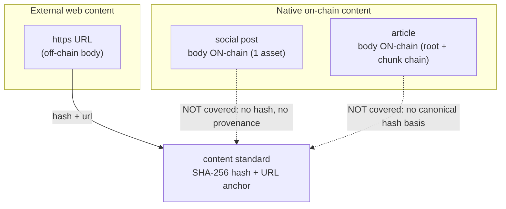
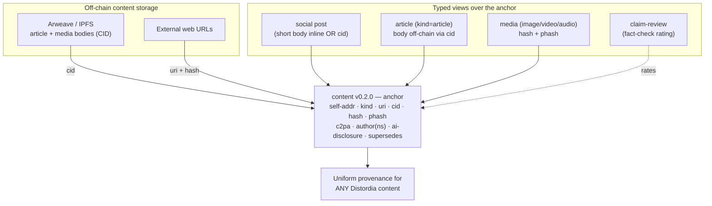
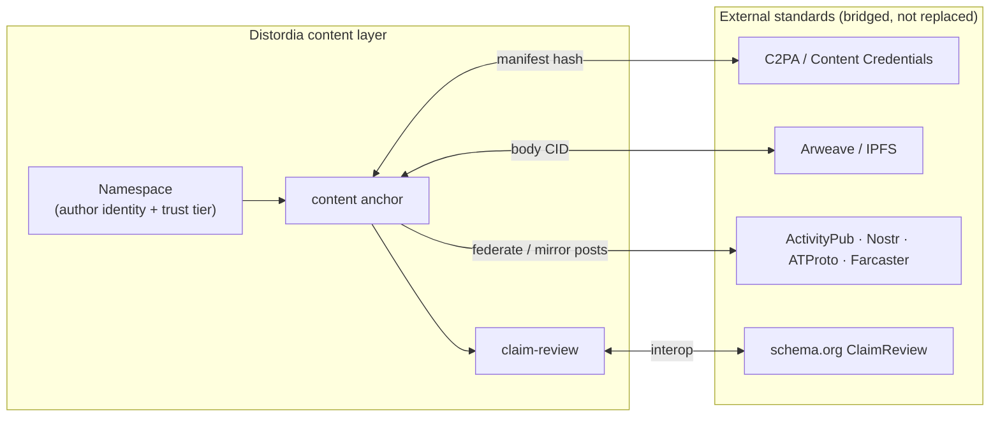

# Design Note — The Content & Publishing Cluster (Content · Articles · Social)

> **Status:** Design proposal (draft). Complements the
> [standards market evaluation](standards-market-evaluation.md) §4, §5, §10 by turning the
> *cross-standard* findings for Content, Articles, and Social into a concrete redesign.
>
> **TL;DR:** Distordia has three content-bearing standards built on two opposite philosophies, and
> they don't compose: the provenance layer (Content) can't verify the native publishing layer
> (Articles/Social), the article linked-list is structurally fragile, and long bodies sit on-chain
> at ~1 NXS/asset under a 5,000-char cap. The fix is **one content/provenance anchor** — body
> off-chain (Arweave/IPFS), `CID + hash + C2PA + author-namespace` on-chain — with Social and
> Articles as **typed views** over it, all cross-linked by `self-addr`.

---

## 1. Current state — three models that don't compose



| Standard | Body location | Verifiable? | Author model | Versioning | Status field |
|---|---|---|---|---|---|
| Content | Off-chain (URL) | Yes (SHA-256) | `author`/`publisher` strings | `supersedes` | `status` |
| Articles | **On-chain** (chunked) | No | `owner` genesis | none | `distordia-status` |
| Social | **On-chain** (1 asset) | No | `owner` genesis | none | `distordia-status` |

The three were clearly meant to interoperate (Articles and Social share `reply-to`/`quote`/`cw`/
`tags`/`lang`), but they diverge on the things that matter for an ecosystem: **where the body
lives, whether it's verifiable, who the author is, how it versions, and what the status field is
called.**

## 2. Issues

1. **The provenance layer doesn't cover native content.** Content verifies *external* URLs; an
   Article or Social post has no hash, no verification status, no C2PA binding. Distordia can verify
   a third-party URL but **not its own published article**.
2. **No canonical hash basis for an article.** An article is a *chain* of assets with no defined
   serialization to hash and no whole-article digest, so it cannot be verified even in principle.
3. **The article linked-list is structurally fragile:**
   - Forward-only `next`, **no `article-id`/back-pointer** → can't query "all chunks of article X";
     an isolated chunk is unattributable.
   - **No atomic multi-asset publish** → a failed mid-publish leaves **orphaned, paid-for, unreachable
     chunks** with no GC.
   - **Per-chunk mutable status** → a chunk can be `deleted`/`hidden` independently, leaving a
     **hole mid-article** with no integrity signal.
   - **No integrity hash** over the chain → a wrong `next` or mutated status silently breaks
     reassembly.
4. **Inconsistent lifecycle/versioning/authorship/status** across the cluster (table above). The
   product work already introduced append-only `rev`/`supersedes`; the content cluster ignores it.
5. **Link fields don't commit to a resolvable key.** `reply-to`/`quote`/`supersedes` are "Address
   of …", but the register address isn't queryable — that's why `self-addr` exists. These must store
   the target's **`self-addr`** or they're unresolvable.
6. **Economics/scale.** ~1 NXS per asset and a 5,000-char cap make on-chain bodies expensive and
   short; the market (Mirror/Arweave, IPFS) stores arbitrarily long bodies off-chain for a fraction
   of a cent.

## 3. Design goals

- **One provenance primitive** that covers external *and* native content.
- **Body off-chain, anchor on-chain** (the pattern Mirror/Arweave/IPFS/C2PA already won with).
- **Verifiable by default**: every piece of Distordia content has a hash and an author bound to a
  namespace.
- **Composable**: Social and Articles are *types* of content, not parallel silos.
- **Consistent** linking (`self-addr`), revisioning (`rev`/`supersedes`), and status vocabulary.

## 4. Proposed model — a unified content anchor with typed views



**Core idea:** keep the `content` standard as the single anchor, extend it to v0.2.0, and make
Social/Articles reference it. Short social posts may keep their body inline (they already fit one
asset); long articles and media store the body off-chain and anchor only `cid + hash`.

### 4.1 `content` v0.2.0 anchor (sketch)

```json
[
  {"name":"distordia-type","value":"content","mutable":false,"maxlength":16},
  {"name":"schema-ver","value":"0.2.0","mutable":false,"maxlength":8},
  {"name":"self-addr","value":"","mutable":true,"maxlength":56},
  {"name":"status","value":"official","mutable":true,"maxlength":12},
  {"name":"kind","value":"article","mutable":false,"maxlength":12},
  {"name":"title","value":"","mutable":false,"maxlength":128},
  {"name":"author","value":"","mutable":false,"maxlength":32},
  {"name":"uri","value":"","mutable":true,"maxlength":160},
  {"name":"cid","value":"","mutable":false,"maxlength":64},
  {"name":"hash","value":"","mutable":false,"maxlength":72},
  {"name":"phash","value":"","mutable":false,"maxlength":40},
  {"name":"c2pa","value":"","mutable":false,"maxlength":72},
  {"name":"ai-disclosure","value":"none","mutable":false,"maxlength":12},
  {"name":"license","value":"","mutable":false,"maxlength":32},
  {"name":"lang","value":"en","mutable":false,"maxlength":2},
  {"name":"reply-to","value":"","mutable":false,"maxlength":56},
  {"name":"quote","value":"","mutable":false,"maxlength":56},
  {"name":"claim-review","value":"","mutable":false,"maxlength":56},
  {"name":"supersedes","value":"","mutable":false,"maxlength":56}
]
```

Key additions vs. v0.1.0:
- **`kind`** (external | post | article | media) — one anchor, many content types.
- **`cid`** — content-addressed body (IPFS/Arweave); survives link rot, unlike `uri` alone.
- **`phash`** — perceptual/soft hash for media (survives transcoding; `hash` alone breaks on re-encode).
- **`c2pa`** — hash/pointer to a C2PA manifest (align with the de-facto provenance standard instead
  of reinventing it).
- **`ai-disclosure`** (none | assisted | generated) — the field the anti-misinformation purpose
  needs and currently lacks.
- **`author`** = **namespace** (attestable), replacing free-text `author`/`publisher`.
- **`claim-review`** — `self-addr` of a fact-check asset (schema.org ClaimReview analog).
- `reply-to`/`quote`/`supersedes`/`claim-review` all store **`self-addr`**.

### 4.2 Articles, fixed

Replace the fragile on-chain linked-list with: **article body stored off-chain (Arweave/IPFS),
anchored by one `content` asset** (`kind=article`, `cid`, `hash`). This removes orphan chunks,
partial-delete holes, the 5,000-char cap, and the integrity gap in one move, and makes articles
verifiable like any other content.

Keep the chunked linked-list **only** as an optional *fully-on-chain fallback* for
censorship-resistance maximalists — and if kept, harden it: add an `article-id` + root back-pointer
to every chunk, a whole-article `hash` in the root, and document that publish is non-atomic so
clients must verify the chain before display.

### 4.3 Social, composed

Social posts stay one-asset (short bodies belong on-chain), but (a) adopt the `content` anchor's
`hash`/`self-addr`/author-namespace conventions so a post is verifiable and resolvable, and (b)
unify the status vocabulary (`distordia-status` → align with `status`). A post that grows past the
inline limit upgrades to `kind=article` with an off-chain `cid` — no separate standard needed.

## 5. Future ecosystem fit



Bridging (rather than reinventing) is what unlocks adoption: anchor **C2PA** manifests, address
bodies on **Arweave/IPFS**, federate posts to **ActivityPub/Nostr/ATProto**, and express fact-checks
as **ClaimReview**. The Namespace standard supplies verifiable authorship to all of it.

## 6. Roadmap (additive, non-breaking)

| Step | Change | Unlocks |
|---|---|---|
| C1 | `content` v0.2.0 anchor (`cid`, `phash`, `c2pa`, `ai-disclosure`, author-namespace) | native + external provenance, AI disclosure |
| C2 | Articles: off-chain body + `content` anchor; deprecate chunk chain to optional fallback | unbounded length, integrity, lower cost |
| C3 | Social: adopt anchor conventions; unify status vocabulary; `self-addr` links | verifiable, composable posts |
| C4 | `claim-review` type + ClaimReview/C2PA/Arweave/federation bridges | fact-checking + external interop |

## 7. Open questions

- Permanence policy: Arweave (permanent, pay-once) vs IPFS (pin-or-perish) — pick a default and a
  pinning SLA tied to namespace tier.
- Deletion vs immutability: off-chain bodies can be unpinned (de-facto delete) while the on-chain
  anchor persists — define what `status=deleted` means for the body.
- Whether short posts should *always* carry a `cid` (uniformity) or allow inline bodies (cost).
