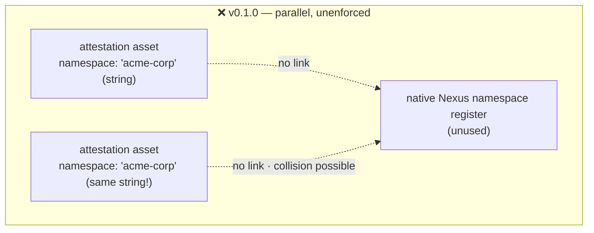
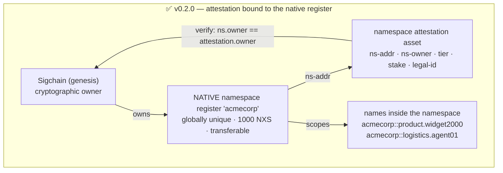
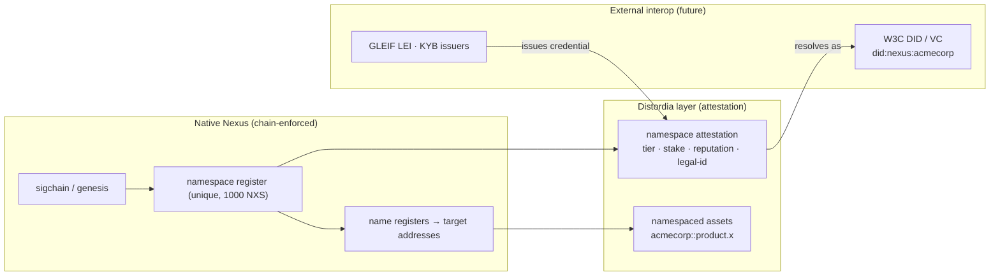

# Design Note — Aligning the Namespace Standard with Native Nexus Names & Namespaces

> **Status:** Design proposal (draft). Supersedes the namespace sections of the
> [market evaluation](standards-market-evaluation.md) §3 with a Nexus-platform-specific correction.
>
> **TL;DR:** Nexus already has a **first-class, globally-unique, transferable namespace object
> register** protected by a 1000 NXS anti-squatting fee. Our v0.1.0 standard ignores it and
> re-implements namespaces as an unenforced string field inside an ordinary asset — so uniqueness
> and ownership are *convention only*. Worse, **Nexus namespaces cannot contain hyphens**
> (lowercase letters, numbers, and periods only), which makes **every namespace example in this
> repository unregistrable on-chain**. The fix: treat the native namespace register as the source of
> truth and make our asset a pure *attestation* bound to it.

---

## 1. What Nexus already provides (verified)

Names and namespaces on Nexus are **object registers**, not application conventions:

| Capability | Native Nexus behaviour |
|---|---|
| **Name registers** | Creating an object (asset, token, account) with a name also creates a **Name object register**, whose register address is derived from a **hash of the name**, and whose `address` field points at the target register. |
| **Three name categories** | **Local**: `user:name` (single colon), scoped to a sigchain, ~1 NXS. **Namespaced**: `namespace::name` (double colon). **Global**: bare `name`, globally unique, 2000 NXS. |
| **Namespace registers** | A namespace is a **globally unique** keyword register. Registration costs **1000 NXS** explicitly as anti-squatting protection. |
| **Character rules** | A namespace is restricted to **lowercase letters, numbers, and periods** — stricter than usernames. **Hyphens are not permitted.** |
| **Ownership** | A namespace is owned by a sigchain (genesis). The owner can **create and sell names** inside it, "just like domain registrars sell domains". |
| **Transferability** | Namespaces (and names) are **transferable** — ownership can change hands. |

Two consequences matter for us: **uniqueness and ownership are already chain-enforced**, and **a
1000 NXS namespace is already a real, non-forgeable sybil cost.**

## 2. Issues with v0.1.0

**N1 — CRITICAL: our namespace pattern is invalid on Nexus.**
v0.1.0 declares `"pattern": "^[a-z][a-z0-9\\-]{2,31}$"` — which **permits hyphens**. Nexus permits
only lowercase letters, numbers, and periods. Every namespace-shaped value in this repository is
therefore **unregistrable as a real Nexus namespace**: `acme-corp`, `acme-logistics-agent`,
`acme-industries`, `distordia-labs`, `forge-manufacturing`, `john-driver`, `premium-rides`.
Correct pattern: **`^[a-z][a-z0-9.]{2,31}$`** → `acme.corp`, `acmecorp`, `distordia.labs`.

**N2 — We re-implemented a registry the chain already enforces.**
`namespace` is a plain string in an ordinary asset. Nothing stops two different sigchains from each
creating an attestation asset claiming `namespace: "acmecorp"`. The native namespace register
already guarantees global uniqueness — we should **bind to it, not duplicate it**.

**N3 — No link from the attestation to the native register.**
The attestation carries no address of the namespace register it describes, so a verifier cannot
perform the one check that makes it trustworthy:

```
resolve native namespace register → read its owner genesis
    → assert it equals the attestation asset's owner genesis
```
Without that, an attestation is an unverifiable self-assertion.

**N4 — Assets are named locally, bypassing the namespace entirely.**
Every create command in the repo uses local names — `name=ns-{namespace}`, `name=product-{art-nr}`,
`name=post-{timestamp}`. If an org owns namespace `acmecorp`, its assets should be created as
**`acmecorp::product.widget2000`**. That makes the namespace the real on-chain grouping, gives every
asset a globally resolvable human-readable name, and inherits the namespace's ownership semantics.
It also provides a **native resolution path we currently ignore**: a named register can be looked up
by name, which is exactly the lookup problem `self-addr` was invented to work around. (`self-addr`
is still needed for *machine* cross-references between unnamed assets, but named org-level assets no
longer depend on it.)

**N5 — Delegation is reinvented.** `parent` + a pipe-separated `delegation-chain` string duplicates
what namespaces do natively: the namespace owner creates and controls names within the namespace,
and periods are legal, so hierarchy is native — `acmecorp::logistics.agent01`. Sub-identities do
**not** each need a 1000 NXS namespace.

**N6 — Transferability is a trust bug we haven't modelled.** Namespaces are sellable. As written,
tier, stake, reputation, and `legal-id` are attached to the *name* — so **buying a namespace would
buy its L3 reputation and legal identity**. The attestation must bind to the owner genesis at
attestation time and be **invalidated on transfer**, requiring re-attestation.

**N7 — Economics ignore a sybil cost we already get for free.** The tier table prices L2 at 2500
DIST while saying nothing about the mandatory 1000 NXS the chain already charges for the namespace
itself. The standard should acknowledge and reconcile these.

**N8 — Which name category is a "namespace"?** Nexus has three; v0.1.0 doesn't say which it means.
Sensible mapping: **organization/enterprise → namespace register**; **individual → username +
local names**; **agent/swarm → a name inside the parent's namespace**, not a namespace of its own.

## 3. Current vs. proposed





## 4. Proposed changes (v0.2.0)

1. **Fix the pattern** to `^[a-z][a-z0-9.]{2,31}$` and re-cast all examples (`acme.corp`).
2. **Bind to the native register**: add `ns-addr` (the namespace register's address) and `ns-owner`
   (the genesis that owned it at attestation time).
3. **Add the verification rule**: an attestation is valid only if the native namespace's current
   owner equals `ns-owner` *and* the attestation asset's own owner. On transfer, `ns-owner` no
   longer matches → attestation auto-invalidates (`status: superseded-owner`) and must be re-issued.
4. **Add `name-category`** (`namespace` | `username` | `global`) so the identity type is explicit.
5. **Drop `delegation-chain`**; express delegation natively as names within the namespace, keeping
   `parent` as the parent namespace for sub-identities.
6. **Document the create/name flow** so assets are created *into* the namespace.
7. **Acknowledge the 1000 NXS** native cost in the tier economics.

## 5. Ecosystem fit



The native register supplies **uniqueness, ownership, and transfer**; the Distordia asset supplies
**trust metadata** (tier, stake, reputation, legal identity); external issuers supply **real-world
verification**. Each layer does only what it can actually enforce.

## 6. Repo-wide follow-up

The hyphen rule (N1) affects **every standard**, because namespace-valued fields appear throughout:
`mfr`, `steward`, `supplier` (product), `author` (content/social/article), `driver`/`passenger`
(NexGo), `namespace` (agent/swarm), `creator` (nft). All current examples use hyphenated values and
must be re-cast to the legal `a.b` form. This is an examples/documentation sweep, not a schema
change — tracked as a follow-up.

## 7. Open questions

- **Maximum namespace length** on Nexus is unverified here; v0.2.0 keeps the conservative 32-char
  field. Confirm against a node before finalising.
- **Exact Names API method names** (beyond `names/create/namespace`) were not verifiable from public
  docs during this review — confirm the full method set and whether an asset can be created directly
  into a namespace in one call, or requires a separate name creation.
- Should **individuals** (L1) use a username + local names (cheap) rather than a 1000 NXS namespace?
  Proposed: yes — see `name-category`.

---

**Sources:** [Nexus Wiki — Dev:API Names](https://nexus-wiki.org/index.php/Dev:API_-_Names) ·
[Nexus Wiki — TAO Naming System](https://nexus-wiki.org/index.php/TAO_Naming_System) ·
[Nexus Wiki — Namespace on Nexus](https://nexus-wiki.org/index.php/Namespace_on_Nexus) ·
[Nexus TAO Naming System (Medium)](https://medium.com/@NexusOfficial/nexus-tao-naming-system-a444952065b4) ·
[Nexus Developer Docs](https://docs.nexus.io/)
