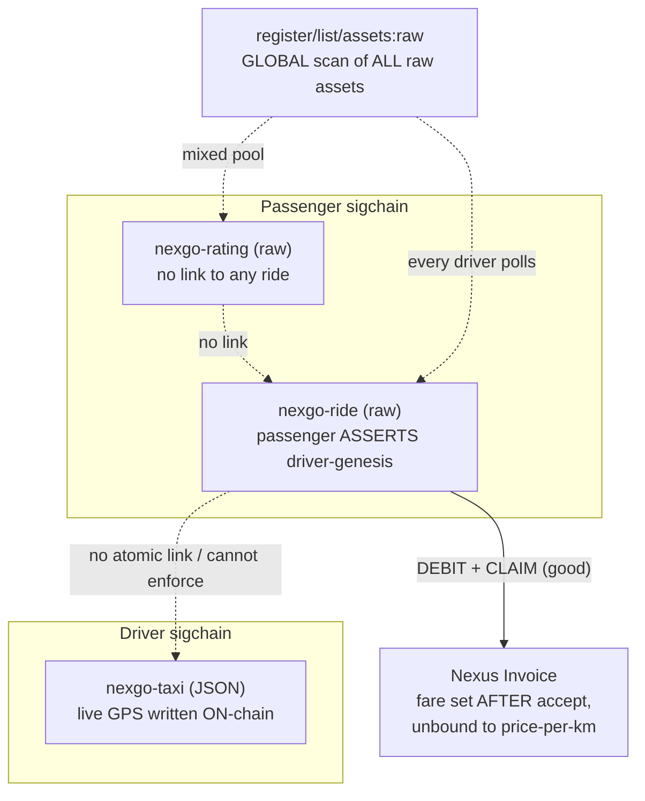
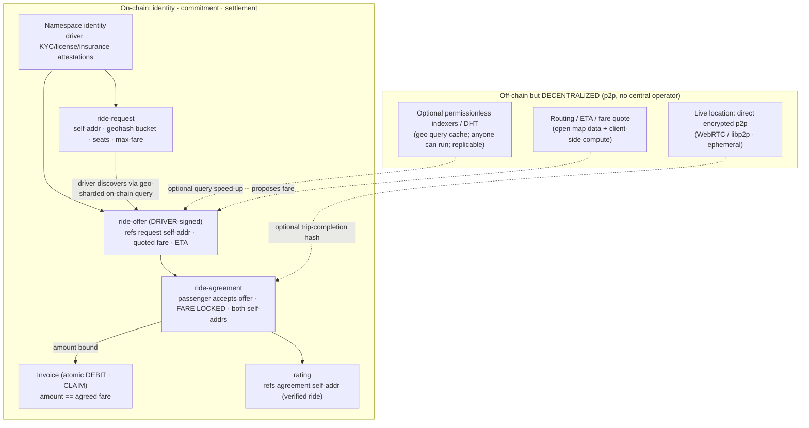
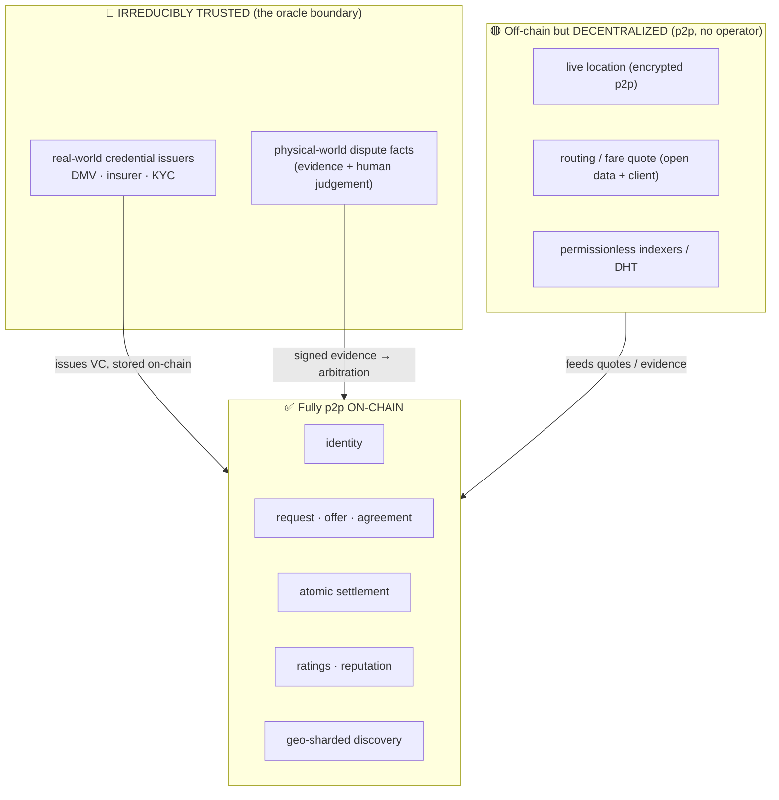
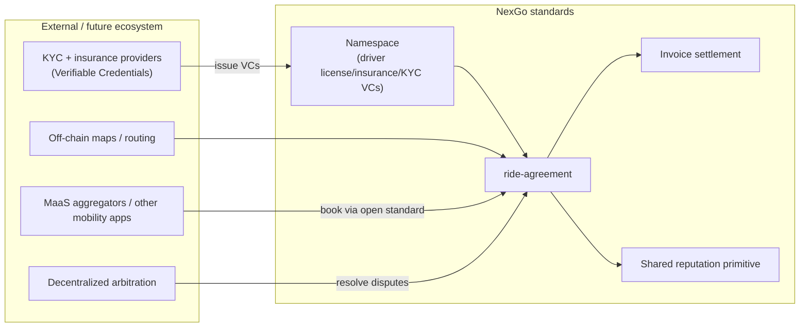

# Design Note — The NexGo Mobility Cluster (Taxi · Ride · Rating + Invoices)

> **Status:** Design proposal (draft). Complements the
> [standards market evaluation](standards-market-evaluation.md) §11–§12 by turning the
> *cross-standard* findings for the NexGo suite into a concrete redesign.
>
> **TL;DR:** A single ride spans four assets across two-plus sigchains with no atomic coordination:
> the passenger *asserts* the driver's acceptance (no on-chain handshake), the fare isn't agreed
> before commitment, discovery is a global scan of every raw asset on the chain, ratings aren't
> linked to real rides, and pickup/destination coordinates plus live GPS are written to a permanent
> public ledger. The atomic invoice settlement is the one piece worth keeping. The fix: keep
> **identity, discovery, consent, settlement, and reputation fully p2p on-chain** (matching becomes
> a geo-sharded on-chain query, not a matchmaker); push only **live location** to a **direct
> encrypted p2p** channel; and make acceptance **driver-signed**. The *only* irreducibly trusted
> parties are real-world **credential issuers** (license/insurance/KYC) and the **physical-world
> dispute oracle** — see §5 for the full on-chain/off-chain/trusted boundary.

---

## 1. Current state — a multi-owner state machine with no atomic coordination



## 2. Issues

1. **Acceptance isn't an on-chain handshake.** The ride asset lives on the *passenger's* sigchain,
   so only the passenger can write `status=accepted` + `driver-genesis`. The driver can't accept
   on-chain; the passenger *asserts* it. Mutual consent is off-chain and unverifiable.
2. **Taxi status drifts.** "Set taxi to `occupied`/`available`" is the *driver's* asset; the ride
   flow can't enforce it → stale/availability-lying state.
3. **Discovery is a global raw scan.** Both Ride and Rating are `raw`, found by listing **all** raw
   assets on the chain and filtering on `distordia-type` *inside* the blob. Every driver polling for
   requests scans the entire raw pool (which also holds ratings). No type-scoped index — the worst
   scaling problem in the suite.
4. **No fare agreed before commitment.** The ride asset has **no `fare` field**; the driver invoices
   *after* accepting and the amount is **unbound** to the taxi's `price-per-km`.
5. **Rating is unlinked and identity is inconsistent.** Ratings key on a driver *genesis* but
   reference **no ride** (rate anyone). Three different driver identifiers across the suite: taxi
   `driver` ("wallet or namespace"), ride `driver-genesis`, rating's genesis key — none routed
   through Namespace.
6. **Privacy — the aggregate harm.** Pickup/destination (Ride) and live GPS (Taxi) on a permanent
   public ledger build a **public, correlatable map of who-went-where and every driver's movement
   history**, de-anonymizing drivers over time. Irreversible; GDPR-incompatible.
7. **Not operable under regulation.** No driver KYC/license/insurance, no compliant trip records, no
   dispute or safety (SOS/trip-share) flow.

**The bright spot:** atomic invoice settlement (DEBIT + CLAIM in one transaction) — guaranteed,
escrow-free payment. Keep it.

## 3. Design goals

- **On-chain = identity, the matching commitment, settlement, and verified-action links.**
- **Off-chain/edge = live location, dispatch/matching, routing.**
- **Driver-signed acceptance** (an offer the driver authors on *their* sigchain).
- **Fare agreed before payment**, bound into the ride agreement.
- **Type-scoped, geo-shardable discovery** instead of a global raw scan.
- **One identity key** (Namespace) for driver and passenger; driver compliance via attestations.
- **Location privacy by construction** (off-chain channel; at most coarse geohash buckets / hashes
  on-chain).

## 4. Proposed flow & assets



### 4.1 What changes

- **`ride-request`** (passenger): replaces raw coordinates with a **coarse geohash bucket** (privacy)
  + seats + `max-fare`. Precise pickup is shared off-chain only after match.
- **`ride-offer`** (driver-authored, on the *driver's* sigchain): references the request `self-addr`,
  carries a **quoted fare** and ETA. This is the **on-chain handshake** that was missing — the
  driver signs their own offer.
- **`ride-agreement`**: created when the passenger accepts a specific offer; **locks the fare** and
  references both the request and offer `self-addr`. The subsequent invoice amount must equal this
  fare.
- **Invoice**: unchanged (the good part), now **bound** to the agreed fare.
- **`rating`**: references the `ride-agreement` `self-addr` → **verified-ride gating** (can't rate a
  ride that didn't happen) and a provable rating↔ride mapping.
- **Identity**: driver and passenger are **namespaces**; driver compliance (license, insurance, KYC)
  rides on the Namespace attestation/credential layer, not free-text strings.
- **Location**: live position moves to a **direct encrypted p2p channel** (WebRTC/libp2p) between the
  matched passenger and driver — no server, no chain; on-chain keeps at most a trip-completion hash.
  No permanent coordinate ledger.
- **Discovery is p2p on-chain, not a matching service.** Ride requests are on-chain assets tagged by
  **geohash shard**; a driver finds nearby work with a **geo-scoped on-chain query**
  (`WHERE geohash LIKE '<cell>%' AND status = 'open'`) and responds with an on-chain `ride-offer`.
  No central matchmaker decides who gets the ride — the passenger picks among signed offers. If the
  register API is too slow to query at volume, a **permissionless indexer** (or DHT) can cache the
  geo-shard — but anyone can run one and they are mutually verifiable against the chain, so this is
  *decentralized off-chain*, never a single trusted operator.

### 4.2 `ride-offer` (driver-signed) sketch

```json
[
  {"name":"distordia-type","value":"nexgo-ride-offer","mutable":false,"maxlength":24},
  {"name":"self-addr","value":"","mutable":true,"maxlength":56},
  {"name":"request","value":"<ride-request self-addr>","mutable":false,"maxlength":56},
  {"name":"driver","value":"<driver namespace>","mutable":false,"maxlength":32},
  {"name":"vehicle","value":"<taxi self-addr>","mutable":false,"maxlength":56},
  {"name":"quoted-fare","type":"uint64","value":0,"mutable":false},
  {"name":"currency","value":"NXS","mutable":false,"maxlength":8},
  {"name":"eta-sec","type":"uint32","value":0,"mutable":false},
  {"name":"status","value":"offered","mutable":true,"maxlength":12}
]
```

Because the offer is created and signed by the driver's own sigchain, acceptance is now mutually
verifiable: the **passenger's `ride-agreement` references a driver-signed offer**, not a
passenger-asserted genesis.

## 5. Fully p2p on-chain — what's achievable vs. what's irreducibly off-chain or trusted

The goal is a **complete p2p on-chain service**. The honest result: **almost everything can be
p2p on-chain or p2p off-chain; only two things are irreducibly trusted**, and both are instances of
the same fundamental limit — *a blockchain cannot witness the physical/legal world.* Critically,
**off-chain ≠ centralized**: most of what can't be on-chain can still be peer-to-peer with no central
operator.

Three tiers:

| Component | Tier | How / why |
|---|---|---|
| Driver & passenger identity | **On-chain p2p** | Namespace assets / sigchain keys |
| Ride request / offer / agreement (consent + fare) | **On-chain p2p** | Signed assets on each party's own sigchain |
| Payment & settlement | **On-chain p2p** | Nexus atomic invoice (DEBIT + CLAIM) — already ideal |
| Ratings & reputation aggregation | **On-chain p2p** | Rating asset gated on agreement; anyone can aggregate |
| Discovery / matching | **On-chain p2p** | Geo-sharded on-chain queries; passenger picks signed offers |
| Live location stream | **Off-chain, decentralized** | Direct encrypted p2p (WebRTC/libp2p). On-chain is impossible (cost/throughput) **and** undesirable (permanent public location ledger). Still no central server. |
| Routing / ETA / fare *quote* | **Off-chain, decentralized** | Open map data (OpenStreetMap) + client-side compute. The agreed fare is on-chain; only the *computation* is off-chain. |
| Query performance at scale | **Off-chain, decentralized** | Optional permissionless indexers / DHT; replicable, verifiable against chain — not a single operator |
| KYC / driver's-license / insurance **issuance** | **Irreducibly trusted** | A DMV/insurer/KYC provider must attest real-world facts. The credential is stored & verified on-chain (as a VC/attestation), but the **issuer is an external authority** — the *oracle into legal reality*. No protocol can manufacture this trust. |
| Dispute facts about the physical world | **Irreducibly trusted (oracle)** | "Did the car actually arrive?" is a real-world fact the chain can't observe. *Resolution* can be decentralized (Kleros-style juror DAO voting on signed GPS/photo evidence), but the **evidence and ultimate human judgment** are a trust layer. |



**Bottom line for the design:** NexGo can be a *complete p2p on-chain service* for everything that is
digital and consent-based. The only unavoidable trusted parties are the **real-world authorities**
(license/insurance/KYC issuers) and the **physical-world oracle** for disputes — and these are
limits of reality, not of the protocol. The design's job is to (a) keep them at the *edge* (a thin
attestation/evidence boundary), and (b) make every issuer/juror role *swappable and competitive*
rather than a single hard-coded operator.

## 6. Future mobility-ecosystem fit



The redesigned agreement + namespace-attested compliance turns NexGo from a closed demo into a
**bookable open mobility standard**: other apps and MaaS aggregators can create `ride-request`s,
KYC/insurance arrive as verifiable credentials on the driver's namespace, routing stays off-chain,
disputes route to decentralized arbitration, and reputation reuses the ecosystem-wide primitive
(see market evaluation §13, P0).

## 7. Roadmap (additive where possible)

| Step | Change | Unlocks |
|---|---|---|
| N1 | Move live GPS to **direct encrypted p2p**; keep taxi registration on-chain | scale + driver location privacy, no operator |
| N2 | **`ride-offer`** (driver-signed) + **`ride-agreement`** (fare-locked) | real on-chain consent + agreed fare |
| N3 | Bind invoice amount to agreement fare; keep atomic settlement | dispute-resistant payment |
| N4 | Gate **`rating`** on a `ride-agreement` self-addr; unify driver identity to Namespace | trustworthy reviews |
| N5 | Geohash-shard requests; **on-chain geo-scoped query** (+ optional permissionless indexer) | privacy + p2p discovery at scale |
| N6 | Driver compliance via Namespace credentials (VCs); juror-DAO arbitration | regulatory operability, decentralized disputes |

## 8. Open questions (the irreducible edges)

- **Regulatory trip records vs. privacy.** Some jurisdictions require retained trip logs — what is
  the minimum on-chain footprint (e.g. a commitment/hash, with the encrypted detail held p2p) that
  satisfies a regulator without building a public location ledger?
- **Physical-world dispute oracle.** Resolution can be a juror DAO, but the *evidence* (GPS traces,
  photos) is off-chain and the *judgement* is human — how are jurors incentivised and evidence
  authenticated without a single trusted operator?
- **No-show / cancellation symmetry** without reintroducing operator-mediated escrow (Nexus
  conditional contracts vs. a small mutual bond).
