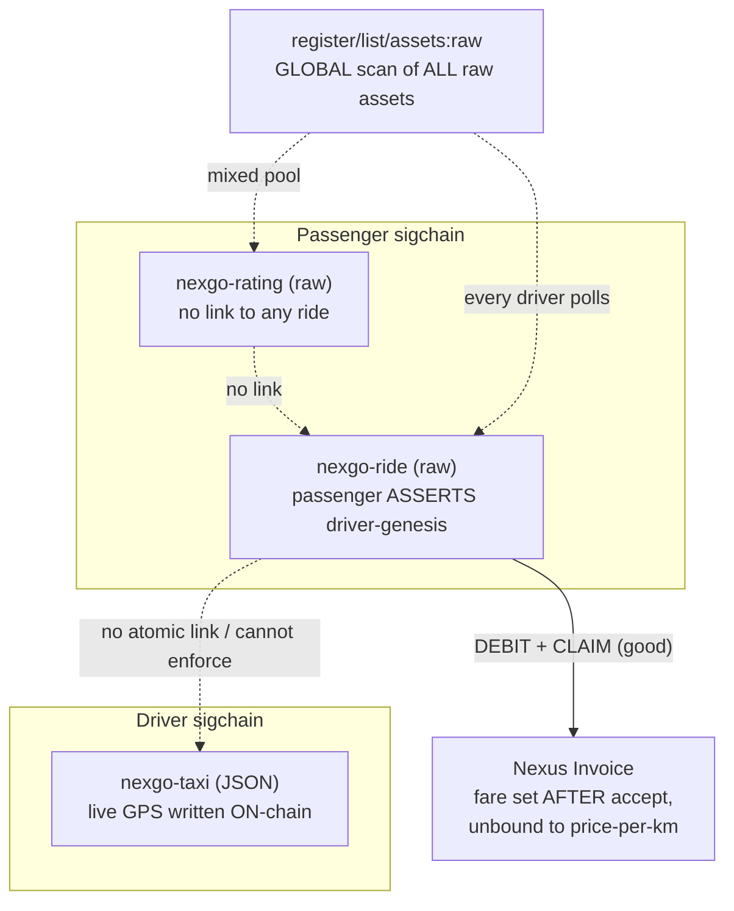
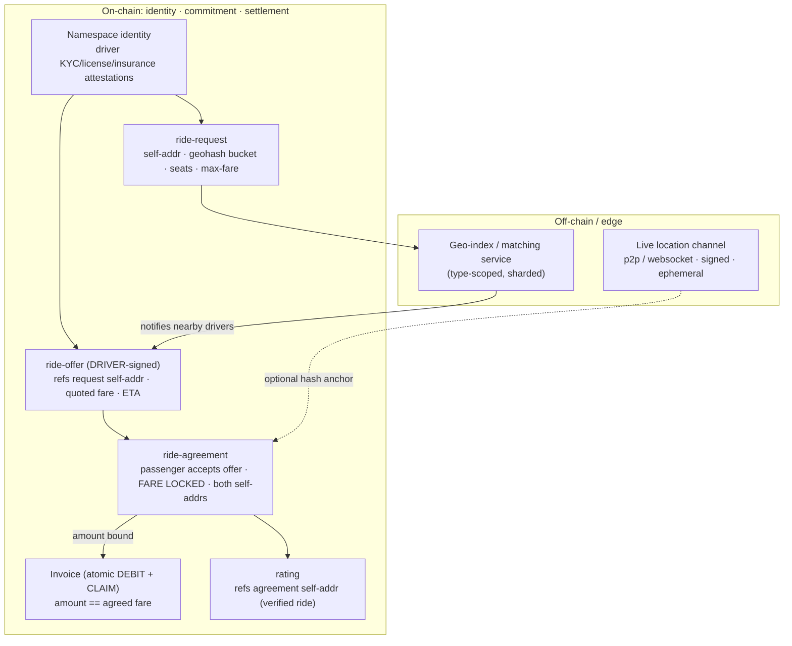
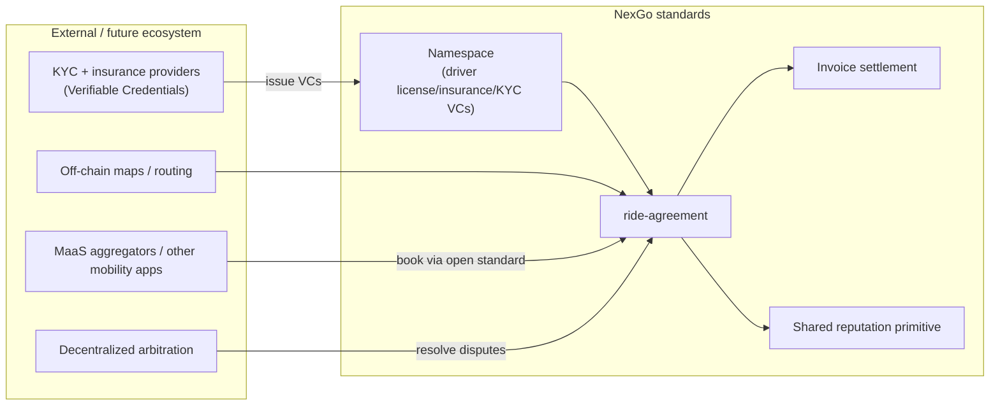

# Design Note — The NexGo Mobility Cluster (Taxi · Ride · Rating + Invoices)

> **Status:** Design proposal (draft). Complements the
> [standards market evaluation](standards-market-evaluation.md) §11–§12 by turning the
> *cross-standard* findings for the NexGo suite into a concrete redesign.
>
> **TL;DR:** A single ride spans four assets across two-plus sigchains with no atomic coordination:
> the passenger *asserts* the driver's acceptance (no on-chain handshake), the fare isn't agreed
> before commitment, discovery is a global scan of every raw asset on the chain, ratings aren't
> linked to real rides, and pickup/destination coordinates plus live GPS are written to a permanent
> public ledger. The atomic invoice settlement is the one piece worth keeping. The fix: put only
> **identity, the matching commitment, settlement, and verified-action links** on-chain, move
> **location and matching off-chain/edge**, and make acceptance **driver-signed**.

---

## 1. Current state — a multi-owner state machine with no atomic coordination



## 2. Issues

1. **Acceptance isn't an on-chain handshake.** The ride asset lives on the *passenger's* sigchain,
   so only the passenger can write `status=accepted` + `driver-genesis`. The driver can't accept
   on-chain; the passenger *asserts* it. Mutual consent is off-chain and unverifiable.
2. **Taxi status drifts.** "Set taxi to `occupied`/`available`" is the *driver's* asset; the ride
   flow can't enforce it → stale/availability-lying state.
3. **Discovery is a global raw scan.** Both Ride and Rating are `raw`, found by listing **all** raw
   assets on the chain and filtering on `distordia-type` *inside* the blob. Every driver polling for
   requests scans the entire raw pool (which also holds ratings). No type-scoped index — the worst
   scaling problem in the suite.
4. **No fare agreed before commitment.** The ride asset has **no `fare` field**; the driver invoices
   *after* accepting and the amount is **unbound** to the taxi's `price-per-km`.
5. **Rating is unlinked and identity is inconsistent.** Ratings key on a driver *genesis* but
   reference **no ride** (rate anyone). Three different driver identifiers across the suite: taxi
   `driver` ("wallet or namespace"), ride `driver-genesis`, rating's genesis key — none routed
   through Namespace.
6. **Privacy — the aggregate harm.** Pickup/destination (Ride) and live GPS (Taxi) on a permanent
   public ledger build a **public, correlatable map of who-went-where and every driver's movement
   history**, de-anonymizing drivers over time. Irreversible; GDPR-incompatible.
7. **Not operable under regulation.** No driver KYC/license/insurance, no compliant trip records, no
   dispute or safety (SOS/trip-share) flow.

**The bright spot:** atomic invoice settlement (DEBIT + CLAIM in one transaction) — guaranteed,
escrow-free payment. Keep it.

## 3. Design goals

- **On-chain = identity, the matching commitment, settlement, and verified-action links.**
- **Off-chain/edge = live location, dispatch/matching, routing.**
- **Driver-signed acceptance** (an offer the driver authors on *their* sigchain).
- **Fare agreed before payment**, bound into the ride agreement.
- **Type-scoped, geo-shardable discovery** instead of a global raw scan.
- **One identity key** (Namespace) for driver and passenger; driver compliance via attestations.
- **Location privacy by construction** (off-chain channel; at most coarse geohash buckets / hashes
  on-chain).

## 4. Proposed flow & assets



### 4.1 What changes

- **`ride-request`** (passenger): replaces raw coordinates with a **coarse geohash bucket** (privacy)
  + seats + `max-fare`. Precise pickup is shared off-chain only after match.
- **`ride-offer`** (driver-authored, on the *driver's* sigchain): references the request `self-addr`,
  carries a **quoted fare** and ETA. This is the **on-chain handshake** that was missing — the
  driver signs their own offer.
- **`ride-agreement`**: created when the passenger accepts a specific offer; **locks the fare** and
  references both the request and offer `self-addr`. The subsequent invoice amount must equal this
  fare.
- **Invoice**: unchanged (the good part), now **bound** to the agreed fare.
- **`rating`**: references the `ride-agreement` `self-addr` → **verified-ride gating** (can't rate a
  ride that didn't happen) and a provable rating↔ride mapping.
- **Identity**: driver and passenger are **namespaces**; driver compliance (license, insurance, KYC)
  rides on the Namespace attestation/credential layer, not free-text strings.
- **Location**: live position moves to an **off-chain signed channel**; on-chain keeps at most a
  trip-completion hash. No permanent coordinate ledger.
- **Discovery**: a **type-scoped, geo-sharded index** (off-chain matching service or per-region
  index assets) replaces the global raw scan.

### 4.2 `ride-offer` (driver-signed) sketch

```json
[
  {"name":"distordia-type","value":"nexgo-ride-offer","mutable":false,"maxlength":24},
  {"name":"self-addr","value":"","mutable":true,"maxlength":56},
  {"name":"request","value":"<ride-request self-addr>","mutable":false,"maxlength":56},
  {"name":"driver","value":"<driver namespace>","mutable":false,"maxlength":32},
  {"name":"vehicle","value":"<taxi self-addr>","mutable":false,"maxlength":56},
  {"name":"quoted-fare","type":"uint64","value":0,"mutable":false},
  {"name":"currency","value":"NXS","mutable":false,"maxlength":8},
  {"name":"eta-sec","type":"uint32","value":0,"mutable":false},
  {"name":"status","value":"offered","mutable":true,"maxlength":12}
]
```

Because the offer is created and signed by the driver's own sigchain, acceptance is now mutually
verifiable: the **passenger's `ride-agreement` references a driver-signed offer**, not a
passenger-asserted genesis.

## 5. Future mobility-ecosystem fit



The redesigned agreement + namespace-attested compliance turns NexGo from a closed demo into a
**bookable open mobility standard**: other apps and MaaS aggregators can create `ride-request`s,
KYC/insurance arrive as verifiable credentials on the driver's namespace, routing stays off-chain,
disputes route to decentralized arbitration, and reputation reuses the ecosystem-wide primitive
(see market evaluation §13, P0).

## 6. Roadmap (additive where possible)

| Step | Change | Unlocks |
|---|---|---|
| N1 | Move live GPS + matching **off-chain**; keep taxi registration on-chain | scale + driver location privacy |
| N2 | **`ride-offer`** (driver-signed) + **`ride-agreement`** (fare-locked) | real on-chain consent + agreed fare |
| N3 | Bind invoice amount to agreement fare; keep atomic settlement | dispute-resistant payment |
| N4 | Gate **`rating`** on a `ride-agreement` self-addr; unify driver identity to Namespace | trustworthy reviews |
| N5 | Geohash-bucket requests; type-scoped/geo-sharded index | privacy + discovery at scale |
| N6 | Driver compliance via Namespace credentials; decentralized arbitration | regulatory operability |

## 7. Open questions

- Where does the **matching service** sit on the centralization spectrum (operator, per-region index
  assets, or fully p2p)? It is the main remaining trust/scale tradeoff.
- Minimum on-chain footprint for **regulatory trip records** (some jurisdictions require retained
  trip logs) vs. the privacy goal of keeping coordinates off-chain.
- No-show / cancellation symmetry: penalties for both sides without reintroducing operator-mediated
  escrow.
