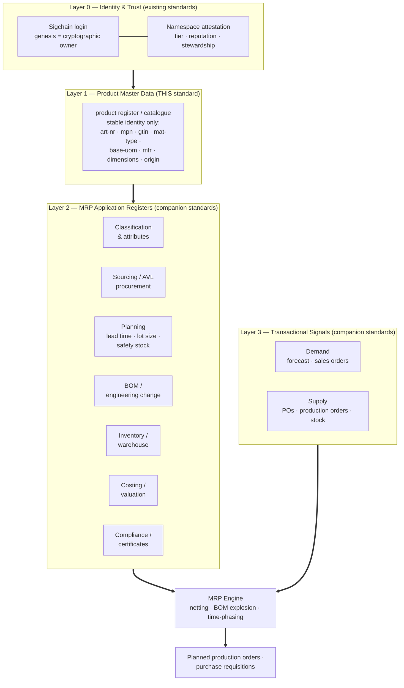
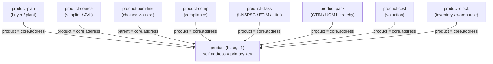

# Product Master Data as the Base Layer of a Decentralized MRP Stack

> **Scope:** A correct framing of the [Distordia Product Masterdata Standard](../standards/product-standard.json)
> (`distordia-type: "product"`, v1.0.0) as the **base identity layer** for a decentralized, B2B,
> common MRP system — *not* as a monolith that must contain all of MRP.
>
> **The thesis in one line:** The master-data standard should be a **deliberately minimal, stable
> product identity register/catalogue**. That scoping is *correct*. MRP capabilities — BOM,
> procurement, planning, warehouse, costing, compliance — are **separate layers of registers and
> applications stacked on top**, each referencing the base by address. This document (1) defends
> that layered model, (2) draws the line between what belongs *in* the base layer and what belongs
> *above* it, (3) identifies the small set of genuine improvements the base layer needs to be a
> production-ready anchor, and (4) sketches how the application layers attach.

---

## 1. Executive Summary

A common mistake when reviewing an on-chain product register is to measure it against the *entire*
feature set of an ERP/MRP suite and conclude it is "incomplete." That conflates two different
things:

- **Master data (the base layer):** *What a product intrinsically is* — its identity and stable,
  context-independent properties. One product, one authoritative record, manufacturer-authored.
- **MRP applications (the layers above):** *How parties relate to and act on that product* — bills
  of material, sourcing, planning parameters, stock, cost, compliance certificates. These are
  **relational and context-dependent** (per plant, per buyer, per supplier, per order) and are
  authored by *different* parties than the manufacturer.

Keeping the master-data register minimal is therefore a **feature, not a deficiency**. It gives the
whole stack a single, stable, immutable anchor that every higher layer can reference without
rewriting. The v1 standard gets this scoping essentially right.

What v1 *does* need is a short list of **base-layer corrections** — a handful of intrinsic-identity
fields and, crucially, the *contracts* a shared anchor must honour (a queryable primary key,
identifier cross-references, stable versioning, and multi-party stewardship). Those are addressed in
§5 and §7. Everything else this document discusses is explicitly framed as **separate layers**
(§4, §6, §8), not as holes in the master-data standard.

---

## 2. The Layered Architecture



**How to read this stack:**

- **Layer 0 (Identity & Trust)** already exists — the [Namespace](../standards/namespace-standard.json)
  standard plus Nexus sigchain/genesis (see §3). It says *who* owns and *who* is trusted.
- **Layer 1 (Product Master Data)** is the subject standard. Its only job is to be the **stable,
  globally referenceable identity** of a product — the row every other layer points at. It is
  manufacturer-authored and (almost entirely) immutable.
- **Layer 2 (MRP Application Registers)** are *separate* standards/registers, each owned by the
  party with authority over that concern (a buyer owns planning, a supplier owns its source record).
  Each links *upward* to the Layer 1 record by its address.
- **Layer 3 (Transactional Signals)** carry the time-varying demand and supply that MRP nets.
- **The MRP Engine** is an *application*, not a register — it reads Layers 1–3 and emits planned
  orders. It is deliberately outside the data standards.

The decisive design point: **the base layer never has to know about the layers above it.** Adding
a BOM, a supplier, or a planning overlay creates new assets in higher layers that *reference* the
product; the product record itself is untouched. That is exactly why the base must stay minimal.

---

## 3. Where the Line Sits — Base Layer vs. Layers Above

The test for "does this belong in the product master record?" is:

> **Is it an intrinsic, context-independent property of *what the product is*** (true regardless of
> who buys it, which plant stocks it, or which order consumes it)? → **Base layer.**
> Is it **relational or context-dependent** (varies by party, plant, supplier, time, or quantity)?
> → **A layer above.**

| Concern | Example data | Layer | Why |
|---|---|---|---|
| Identity | `art-nr`, `mpn`, `gtin`, `mfr`, `brand` | **Base (L1)** | Intrinsic; the product's name and keys |
| Material type | raw / semi-finished / finished / service | **Base (L1)** | Intrinsic; also tells layers above which apply |
| Base unit of measure | `base-uom` | **Base (L1)** | The unit identity is denominated in |
| Physical facts | weight, dimensions, country of origin, HS code | **Base (L1)** | Properties of the item itself |
| Intrinsic substance IDs | CAS / UN number (for a chemical) | **Base (L1)** | A property of the *material*, not an app |
| Classification | UNSPSC / eCl@ss / ETIM, attributes | App (L2) | Multiple schemes, evolves, many authorities |
| Bill of Materials | components, qty, scrap, effectivity | App (L2) | A *relationship* between products |
| Sourcing / AVL | supplier, supplier PN, MOQ, price, lead time | App (L2) | Per-supplier; supplier-authored |
| Planning | MRP type, lead times, lot size, safety stock | App (L2) | Per-plant/buyer; buyer-authored |
| Costing / valuation | standard price, currency | App (L2) | Per-org finance context |
| Compliance certificates | RoHS/REACH status, SDS, test reports, UDI serials | App (L2) | Per-jurisdiction, time-bound, issued by others |
| Inventory / warehouse | on-hand, bin, batch, serial | App (L2) | Per-location, constantly changing |
| Packaging / UOM hierarchy | each/case/pallet GTINs, conversions | App (L2) | A set of related trade items, not one identity |
| Demand / supply | forecasts, sales orders, POs, production orders | Signal (L3) | Transactional, time-phased |

Note the deliberate restraint: **only the first six rows belong in the master-data standard.**
Everything below the line is a companion standard. The few base-layer rows that v1 is missing or
under-specifies are the subject of §5; the layers above are the subject of §6.

---

## 4. The MRP Application Layers (Companion Standards, Not Master-Data Gaps)

A full MRP run is a netting engine:

```
   Net Requirement = Gross Requirement (demand) − On-hand − Scheduled Receipts
   … exploded down the BOM, offset by lead time, rounded to lot-sizing rules,
     and routed by make-or-buy.
```

Every italic term is data — but **none of it is master data.** It lives in the layers above and
references the Layer 1 product by address. The table below catalogues those layers so the reader can
see the *whole* MRP picture **without** importing any of it into the base standard.

| Application layer | Owns / authors | Key data | References base via |
|---|---|---|---|
| **Planning** | Buyer / plant | MRP type, planned delivery + production lead time, GR time, safety stock, reorder point, min/max/rounding lot | `product = <core address>` |
| **Sourcing / Procurement** | Supplier (per source) | supplier namespace, supplier PN, MOQ, price + currency, lead time, incoterm, preference/quota | `product = <core address>` |
| **BOM / Engineering** | Designing org | parent↔component links, qty, scrap, alternates, revision effectivity | `parent = <core address>` |
| **Costing / Valuation** | Finance org | standard/moving price, price unit, currency, valuation class | `product = <core address>` |
| **Inventory / Warehouse** | Stock-holder / plant | on-hand, location/bin, batch, serial, status | `product = <core address>` |
| **Classification & Attributes** | Catalogue steward | UNSPSC/eCl@ss/ETIM codes, characteristic key-values | `product = <core address>` |
| **Compliance / Certificates** | Manufacturer / authority | UN/hazard class, RoHS/REACH, SDS, UDI/serialization, certificate hashes | `product = <core address>` |
| **Packaging / UOM hierarchy** | Manufacturer | each/inner/case/pallet GTINs, qty-of-base, conversion factors, catch-weight | `product = <core address>` |
| **Demand signal (L3)** | Sales / forecast | forecast qty, sales-order lines, dates | `product = <core address>` |
| **Supply signal (L3)** | Purchasing / production | open PO, production order, due dates | `product = <core address>` |

Each row is a candidate **companion standard** in this repo (`product-plan`, `product-source`,
`product-bom-line`, `product-cost`, `product-stock`, `product-class`, `product-comp`,
`product-pack`, plus demand/supply standards). §8 sketches the schemas. The point of this section is
purely framing: **these are layers, not holes.**

---

## 5. Genuine Base-Layer Gaps in v1 (the short list)

Because the master-data standard's job is to be a *stable, shared anchor*, the only legitimate
critiques are: (a) is it missing an **intrinsic identity** attribute the layers above need to anchor
on, and (b) does it honour the **contracts** of being a common primary key? There are six, and they
are small.

**B1 — Missing `mpn` (Manufacturer Part Number).** In electronics, automotive, and industrial MRO,
the MPN — not the GTIN — is the real identity key (many parts have no GTIN). Every sourcing and
cross-reference layer anchors on it. *Intrinsic; belongs in the base.*

**B2 — Missing `mat-type` (material type).** raw / semi-finished / finished / packaging / MRO /
service. This is intrinsic *and* it is the switch that tells the layers above which of them even
apply (a service has no BOM or weight). *Intrinsic; belongs in the base.*

**B3 — `uom` should be `base-uom` only.** The base unit the identity is denominated in is intrinsic;
**conversions and packaging levels are a separate layer** (`product-pack`). v1 conflates the two by
implying one operational UOM. Narrow the base to `base-uom`. *Intrinsic; belongs in the base.*

**B4 — Weak identifier/cross-reference contract.** B2B interoperability *is* identifier mapping. The
base should carry the canonical keys (`art-nr`, `mpn`, `gtin`) with validation (GTIN check digit),
and treat additional cross-references (supplier PN, OEM/aftermarket equivalents) as an upper layer.
v1 has only `art-nr` + an unvalidated `gtin`. *Base contract.*

**B5 — Queryability & linkage contract (self-`address`).** For a register to be a shared anchor,
every higher layer must be able to *find and link to* a base record by key. Because the Nexus
register `address` is auto-assigned and not filterable in the list API, the base record must
duplicate its address into a queryable field (see §7.1). Without this contract the layered model
cannot physically link. *Base contract — the single most important fix.*

**B6 — Stewardship & versioning semantics for a *shared* register.** "Common" means many parties
read and a controlled set may correct. The base needs: a `steward` namespace, a data-quality signal,
an append-only revision (`rev` + `supersedes`) instead of silent `mutable: true` overwrites, and
reliance on the namespace tier/reputation for authority. v1 ties everything to the single creating
sigchain with naive mutability. *Base contract.*

Optionally, **intrinsic substance identifiers** (CAS/UN number for chemicals) are arguably base
(they describe the material), while the *handling/transport* compliance built on them is a layer
above (§6). v1's single boolean `hazard` is too coarse for either; the base should carry the
substance ID and defer hazmat handling to the compliance layer.

That is the complete list. Note what is **not** here: BOM, planning, sourcing, costing, warehouse —
all correctly excluded as upper layers.

---

## 6. Industry View — Requirements Distributed Across Layers

Different product worlds need very different data, but the layered model holds for all of them: a
small base-identity footprint, plus heavier reliance on specific upper layers. The point of this
section is to show that **no industry needs the base layer to grow much** — they need the *right
layers* above it.

For each domain: **Base layer carries** (intrinsic identity) → **leans on layers** (above).

| Domain | Base layer carries | Leans heavily on layers |
|---|---|---|
| **Electronics / components** | `mpn` (key), `mfr`, dimensions, package code | Sourcing/AVL, Compliance (RoHS/REACH/MSL), Classification (ETIM), Attributes |
| **Chemicals / paints / lubricants** | CAS/UN substance ID, `base-uom`, density | Compliance (hazmat, SDS), Inventory (batch), Packaging/UOM |
| **Food & beverage** | `gtin`, origin, `base-uom`, net content | Compliance (allergens, nutrition), Inventory (lot/expiry), Classification (GS1 GDSN) |
| **Pharma / medical devices** | `gtin`/NDC, `mfr`, dosage form | Compliance (serialization/UDI/DSCSA), Inventory (lot/expiry, cold chain) |
| **Apparel / footwear / textiles** | parent style + variant identity, composition | Classification (variant axes: size/colour), Packaging, Sourcing |
| **Automotive / MRO** | `mpn`/OEM PN, `mfr`, `rev` | Cross-reference layer (aftermarket equivalents), Sourcing/AVL, BOM, Inventory |
| **Raw materials / metals** | grade/spec, `base-uom`, density | Packaging/UOM (catch-weight), Compliance (mill certs), Inventory (heat/lot) |
| **Construction / building** | dimensions, weight, `gpc` | Classification (ETIM), Compliance (DoP/CE), Packaging (pack/pallet) |
| **Machinery / ETO** | `mpn`, `mat-type`, `rev` | BOM/engineering (multi-level + effectivity), Sourcing, Costing |
| **Digital goods / services** | `mat-type=service`, version | Sourcing (license/entitlement), Costing (subscription UOM) |

**Cross-industry summary (which layer each capability lives in):**

| Capability | Layer | Elec | Chem | Food | Pharma | Apparel | Auto | Metals | Constr | Mach | Digital |
|---|---|:--:|:--:|:--:|:--:|:--:|:--:|:--:|:--:|:--:|:--:|
| Identity (mpn/gtin/mat-type) | **Base L1** | ✔ | ✔ | ✔ | ✔ | ✔ | ✔ | ✔ | ✔ | ✔ | ✔ |
| Bill of Materials | App L2 | – | – | ◐ | ◐ | ◐ | – | – | – | ✔ | – |
| Sourcing / AVL / lead time | App L2 | ✔ | ✔ | ✔ | ✔ | ✔ | ✔ | ✔ | ✔ | ✔ | ◐ |
| Planning (lot/lead/safety) | App L2 | ✔ | ✔ | ✔ | ✔ | ✔ | ✔ | ✔ | ✔ | ✔ | ◐ |
| UOM / packaging hierarchy | App L2 | ◐ | ✔ | ✔ | ◐ | ◐ | ◐ | ✔ | ✔ | ◐ | ✔ |
| Compliance depth | App L2 | ✔ | ✔ | ✔ | ✔ | ◐ | ◐ | ✔ | ✔ | ◐ | – |
| Inventory / batch / serial | App L2 | ◐ | ✔ | ✔ | ✔ | – | ✔ | ✔ | ◐ | ✔ | – |
| Classification / attributes | App L2 | ✔ | ✔ | ✔ | ✔ | ✔ | ✔ | ✔ | ✔ | ✔ | ✔ |

✔ = critical · ◐ = important · – = minor. **Only the top row is the base standard's responsibility.**
Every other row is a companion layer — which is precisely why the base stays small.

---

## 7. The Base-Layer Standard, Done Right (`product.v2` core)

This section specifies the improved **base layer only** — the small, stable anchor. The upper-layer
schemas are sketched separately in §8.

### 7.1 Nexus platform grounding (identity, system fields, addressing)

The base layer must be correct about how Nexus handles login, identity, and asset creation.

**Login is a signature chain (Sigchain).** A user unlocks their Nexus **sigchain** with credentials
(username + password + PIN). Every `assets/create|update` is a signed transaction appended to the
owner's sigchain — the sigchain *is* the account ledger. No schema stores credentials.

**Identity has two layers — genesis (machine) vs. namespace (human-readable):**
- The **genesis hash** is the immutable 256-bit root identity of a sigchain. It does not change when
  credentials rotate, and Nexus auto-stamps it into every asset's `owner` field. *Genesis = who
  cryptographically owns the asset.*
- A **namespace** is a separate, human-readable register owned by a sigchain; Distordia attests
  tier/reputation to the **namespace**, which resolves to its owning genesis. *Namespace = the
  attestable, human-readable entity.*
  → Identity-referencing fields (`mfr`, `steward`) store **namespaces**, never raw genesis hashes;
  the cryptographic owner is already captured automatically in `owner`.

**Asset creation auto-assigns system attributes — schemas must not redefine them:**

| System attribute | Meaning |
|---|---|
| `address` | Unique register locator (base58, ~51 chars) — the on-chain primary key |
| `owner` | Creator's **genesis hash** |
| `type` / `form` | `OBJECT` / `ASSET` (or `RAW`) |
| `version` | `1` at create, increments on each update |
| `created` / `modified` | Unix timestamps (uint64) |

**The 1 KB cap includes system overhead.** Total serialized register size ≤ 1 KB; platform fields
consume **~180 B**, leaving **~820 B** for user data. The self-`address` field below counts against
that budget.

**Self-`address` convention (REQUIRED — this is base-contract B5).** The register `address` is the
primary key but is **not a filterable column** in `register/list/assets`, so an asset cannot be
located or cross-referenced by its own address through query. Every Distordia asset therefore
**duplicates its register address into a normal, queryable `address` field**, via a two-step write:

1. `assets/create/asset format=JSON name=… json='[…]'` → Nexus returns the new register `address`.
2. `assets/update/asset address=<returned> address="<returned>"` → stamp it into the `address` field.

`address` is thus `mutable: true` (written once, post-create). **Every upper-layer link** (`product`,
`parent`, `component`, `supersedes`, `next`) stores the *target's* `address` value, resolved with
`WHERE address = '<value>'`. *Caveat:* if a node rejects a user field literally named `address`
(reserved-name collision), use `self-addr` consistently — same convention.

### 7.2 Proposed base-layer schema

Additions to v1 are **bold**; the record stays a lean identity anchor and pushes everything
relational to the layers above.

```json
[
  {"name":"distordia-type","type":"string","value":"product","mutable":false,"maxlength":16},
  {"name":"schema-ver","type":"string","value":"2.0.0","mutable":false,"maxlength":8},
  {"name":"address","type":"string","value":"","mutable":true,"maxlength":56},
  {"name":"status","type":"string","value":"valid","mutable":true,"maxlength":8},
  {"name":"art-nr","type":"string","value":"","mutable":false,"maxlength":32},
  {"name":"mpn","type":"string","value":"","mutable":false,"maxlength":40},
  {"name":"gtin","type":"string","value":"","mutable":false,"maxlength":14},
  {"name":"mat-type","type":"string","value":"finished","mutable":false,"maxlength":12},
  {"name":"desc","type":"string","value":"","mutable":true,"maxlength":128},
  {"name":"mfr","type":"string","value":"","mutable":false,"maxlength":40},
  {"name":"brand","type":"string","value":"","mutable":false,"maxlength":32},
  {"name":"base-uom","type":"string","value":"EA","mutable":false,"maxlength":4},
  {"name":"gpc","type":"string","value":"","mutable":false,"maxlength":8},
  {"name":"hs","type":"string","value":"","mutable":false,"maxlength":10},
  {"name":"origin","type":"string","value":"","mutable":false,"maxlength":2},
  {"name":"weight-g","type":"uint32","value":0,"mutable":false},
  {"name":"length-mm","type":"uint32","value":0,"mutable":false},
  {"name":"width-mm","type":"uint32","value":0,"mutable":false},
  {"name":"height-mm","type":"uint32","value":0,"mutable":false},
  {"name":"lifecycle","type":"string","value":"active","mutable":true,"maxlength":8},
  {"name":"rev","type":"string","value":"A","mutable":false,"maxlength":8},
  {"name":"steward","type":"string","value":"","mutable":false,"maxlength":32},
  {"name":"dq-score","type":"uint16","value":0,"mutable":true},
  {"name":"supersedes","type":"string","value":"","mutable":false,"maxlength":56}
]
```

This implements exactly the six base-layer fixes of §5 and nothing more:
- **`address`** (B5) — queryable self-address; the linchpin of the layered model.
- **`mpn`** (B1), **`mat-type`** (B2), **`base-uom`** (B3) — intrinsic identity additions.
- **`mfr`/`steward`** store **namespaces** (B4/B6); validated `gtin` + `art-nr` are the keys.
- **`rev` + `supersedes` + `dq-score`** (B6) — append-only revision and stewardship signal.
- Moved *out* to upper layers: `cat/subcat`→classification, `url/img`→media/classification,
  `hazard/perish/shelf-days`→compliance, `replaces/replaced-by`→`rev`/`supersedes`, all UOM
  conversion/packaging→`product-pack`.

**1 KB budget check (base v2):**

| Bucket | Bytes (approx.) |
|---|---|
| System/platform fields (`address`-locator, `owner`, `type`, `form`, `version`, `created`, `modified`) | ~180 reserved |
| User fields — names + structural overhead (24 fields) | ~280 |
| User fields — values at *typical* fill (gtin 13, mpn ~16, desc ~60, address 51, codes short) | ~320 |
| **Typical total** | **~780 / 1024** ✅ |
| User fields — values at *worst-case* maxlength | ~540 |
| **Worst-case total** | **~1000** — fits, `desc` is the swing field |

Immutable string fields store their actual (short) length, so real records sit well under 1 KB.
`desc` is the only large mutable string; trim to ~96 if your node pre-allocates mutable fields.

---

## 8. Companion-Standard Sketches (the layers above)

Each upper layer is its own asset type/standard, owned by the authoring party, carrying its own
self-`address`, and linking to the base via `product = <core address>` (BOM via `parent`). These are
**separate standards**, developed independently of the master-data standard — adding them never
touches the base record.



**`product-plan` (Planning layer — buyer/plant owned).** The asset that turns the catalogue into
something *plannable*.
```json
[
  {"name":"distordia-type","value":"product-plan","mutable":false},
  {"name":"address","value":"","mutable":true,"maxlength":56},
  {"name":"product","value":"<core-address>","mutable":false,"maxlength":56},
  {"name":"plant","value":"","mutable":false,"maxlength":16},
  {"name":"mrp-type","value":"PD","mutable":true,"maxlength":4},
  {"name":"lot-proc","value":"EX","mutable":true,"maxlength":4},
  {"name":"lead-buy-d","type":"uint16","value":0,"mutable":true},
  {"name":"lead-make-d","type":"uint16","value":0,"mutable":true},
  {"name":"gr-proc-d","type":"uint16","value":0,"mutable":true},
  {"name":"safety-stock","type":"uint32","value":0,"mutable":true},
  {"name":"reorder-pt","type":"uint32","value":0,"mutable":true},
  {"name":"min-lot","type":"uint32","value":0,"mutable":true},
  {"name":"max-lot","type":"uint32","value":0,"mutable":true},
  {"name":"round-val","type":"uint32","value":0,"mutable":true},
  {"name":"mrp-ctrl","value":"","mutable":true,"maxlength":8}
]
```

**`product-source` (Sourcing layer — one per supplier).** `supplier` is a **namespace**.
```json
[
  {"name":"distordia-type","value":"product-source"},
  {"name":"address","value":"","mutable":true,"maxlength":56},
  {"name":"product","value":"<core-address>"},
  {"name":"supplier","value":"<namespace>"},
  {"name":"supplier-pn","value":"","maxlength":40},
  {"name":"moq","type":"uint32","value":0},
  {"name":"lead-d","type":"uint16","value":0},
  {"name":"price","type":"uint64","value":0},
  {"name":"price-uom","value":"EA"},
  {"name":"currency","value":"USD","maxlength":3},
  {"name":"incoterm","value":"","maxlength":3},
  {"name":"preference","type":"uint8","value":0},
  {"name":"quota-pct","type":"uint8","value":0}
]
```

**`product-bom-line` (BOM/engineering layer — one asset per component; solves "no arrays").** Lines
chain via `next` like article chunks; each carries its self-`address`.
```json
[
  {"name":"distordia-type","value":"product-bom-line"},
  {"name":"address","value":"","mutable":true,"maxlength":56},
  {"name":"parent","value":"<parent-core-address>"},
  {"name":"component","value":"<component-core-address>"},
  {"name":"qty-milli","type":"uint64","value":0},
  {"name":"comp-uom","value":"EA"},
  {"name":"scrap-bps","type":"uint16","value":0},
  {"name":"alt-group","type":"uint8","value":0},
  {"name":"eff-from","type":"uint64","value":0},
  {"name":"eff-to","type":"uint64","value":0},
  {"name":"next","value":"<address-of-next-bom-line>"}
]
```
(`qty-milli` = qty ×1000; `scrap-bps` = basis points. Find a BOM: `WHERE parent = '<core-address>'`,
then walk `next`.)

**Other layers (same pattern, schemas analogous):**
- **`product-comp` (Compliance):** `un-number`, `hazard-class`, `packing-group`, `sds-url`/`sds-hash`,
  `rohs`, `reach`, `cas`, `allergens`, `udi`, `cert-list` (pipe-separated certificate addresses).
- **`product-class` (Classification & attributes):** `unspsc`, `eclass`, `etim`, `cat`, `subcat`,
  and `attrs` (`key=value;…`); for deep attribute sets, point to a `raw`-format asset (à la the
  NexGo rating standard) that allows nested JSON.
- **`product-pack` (Packaging / UOM hierarchy):** one per level — `level` (each/inner/case/pallet),
  `gtin`, `qty-of-base`, `uom`, `to-base-factor`, dimensions, `weight-g`, `catch-weight`.
- **`product-cost` (Valuation):** `price`, `currency`, `price-unit`, `valuation-class`, `plant`.
- **`product-stock` (Inventory):** `plant`, `location`, `batch`, `serial`, `on-hand`, `status`.

---

## 9. Governance, Validation & Roadmap

### 9.1 Governance for a *common* (shared) register
- **Base layer:** the core identity must be created by an **L2+ organization** namespace
  (manufacturer/brand owner). The base is mostly immutable; corrections are append-only via
  `rev`/`supersedes`.
- **Upper layers:** any verified namespace may attach its own overlay (`product-plan`,
  `product-source`, …) referencing the base — this is what makes the register *common*. A consumer
  selects "the planning view for *my* namespace" by filtering overlays on owner.
- **Trust & disputes:** reuse the namespace standard's **tier / reputation / slashing**. A disputed
  record is flagged via a lightweight `product-flag` raw asset with stake at risk (same mechanic as
  swarm mission disputes).
- **Data quality (`dq-score`, 0–1000):** completeness + validity (GTIN check digit, ISO code
  membership, HS format) + steward tier, mirroring **ISO 8000-61** dimensions; provenance via
  `steward`/`rev`/`supersedes` + system `created` satisfies **ISO 8000-115**.

### 9.2 Production-readiness checklist
1. **Validation rules** — GTIN/EAN check digit, ISO 3166 country, ISO 4217 currency, HS format,
   GPC membership, UOM code list.
2. **Reference-data registries** — published code lists (UOM, currency, incoterm, hazard class,
   classification schemes) so values are *codes*, not free text.
3. **Conformance suite** — golden base + per-layer example assets for the ten domains in §6, plus
   negative tests, for self-certification.
4. **Crosswalks** — GS1 GDSN, UNSPSC/eCl@ss/ETIM, ISO 8000, SAP/Oracle (Appendix A).
5. **Schema governance** — semantic versioning (`schema-ver`), deprecation policy, additive-only
   field changes.

### 9.3 Roadmap (base first, then layers — all additive)

| Level | Adds | Unlocks |
|---|---|---|
| **M0 (today, v1)** | flat catalogue record | universal product reference |
| **M1 — solid base** | v2 core: `address`, `mpn`, `mat-type`, `base-uom`, `rev`, stewardship | a stable, queryable, trustworthy **anchor** |
| **M2 — Planning layer** | `product-plan` | **first real MRP** (netting + time-phasing + lot-sizing) |
| **M3 — Sourcing + Packaging** | `product-source`, `product-pack` | multi-source procurement, UOM/packaging |
| **M4 — BOM layer** | `product-bom-line` chains | BOM explosion → manufacturing MRP |
| **M5 — Compliance + Class + Signals** | `product-comp`, `product-class`, demand/supply | regulated industries + full common stack |

M1 is the only change to the **master-data standard itself**; M2–M5 are *new companion standards*
that leave the base untouched.

---

## 10. Conclusion

The Distordia product standard is **correctly scoped as a base layer**: a minimal, stable,
manufacturer-authored product identity register. That minimalism is the feature that lets a
decentralized B2B network *share* it — every other concern stacks on top as a separate, independently
owned register that references the base by address.

So the right critique is narrow. The base needs **six small fixes** (§5): a queryable self-address,
`mpn`, `mat-type`, `base-uom`, validated identifiers, and shared-register stewardship/versioning.
With those, the base is production-ready *as a base*. Everything else MRP requires — BOM, sourcing,
planning, costing, warehouse, compliance — is **not** master data and should never be pushed into it;
it belongs to the companion layers sketched in §8 and diagrammed in §2. Build the anchor well, keep
it small, and let the MRP stack grow upward.

---

## Appendix A — Interoperability Crosswalk (illustrative)

| Distordia | Layer | GS1 GDSN | UNSPSC/eCl@ss/ETIM | ISO | SAP | Oracle |
|---|---|---|---|---|---|---|
| `gtin` | Base | `gtin` | — | GS1 | `EAN11` | Item Cross Ref |
| `mpn` | Base | `manufacturerPartNumber` | — | — | `MFRPN` | Mfg Part Number |
| `mat-type` | Base | `tradeItemUnitDescriptor` | — | — | `MTART` | Item Type |
| `base-uom` | Base | `baseUnitOfMeasure` | — | ISO 80000 / UN/ECE Rec 20 | `MEINS` | Primary UOM |
| `product-plan.lead-buy-d` | L2 | — | — | — | `PLIFZ` | Lead Time |
| `product-plan.safety-stock` | L2 | — | — | — | `EISBE` | Safety Stock |
| `product-source.moq` | L2 | — | — | — | `BSTMI` | Min Order Qty |
| `product-class.unspsc` | L2 | `gpcCategoryCode` | UNSPSC / eCl@ss / ETIM | ISO 22745 | `PRDHA` | Category |
| `product-comp.un-number` | L2 | `dangerousGoodsUNNumber` | — | UN ADR | — | Hazard Class |
| `dq-score` | Base | — | — | **ISO 8000-61** | — | — |

*(Illustrative; a production release should publish authoritative, versioned mapping tables per
scheme.)*
